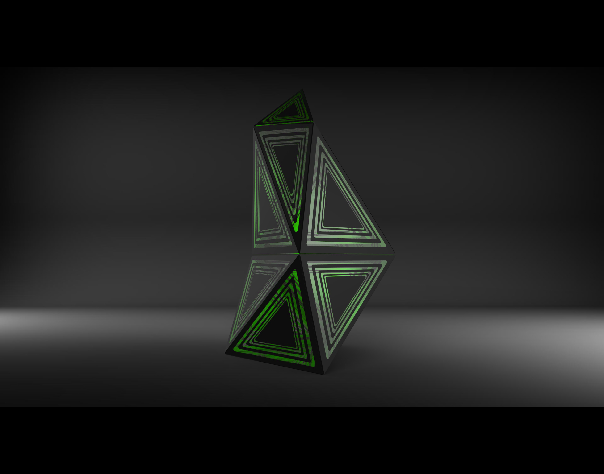

# event-station
stations that have active components to engage the exchange of resources. some can be mobile.
# Conceptual Components

* A switch to toggle teams;
* HP indicator for a station. 


The concept has 3 main features:
1. Area of effect
We use the acoustic signal to achieve the area effect. The totem is similar to transmitters keeps sending acoustic signals. So all of the players around a totem can receive sound signals equally and then get healed.

2.Deactivatedable
It means that the totem can be destroyed by the enemies. The purpose of doing this characteristic is to improve the playability. Players can develop strategies together to think about how to protect their totems or attack enemy’s totem.

3.Switchable system (future plan)
The totem’s functionality is not limited to healing. We also designed other features like increasing team’s defense ability and increasing the attack damage. Players can switch different functions by buttons. Players can only have one effect at the same time.


The main station (totem) idea we had in mind first, which is big in terms of size:


After some in-class discussion, we were advised to try an attachable approach to make something smaller in size and more affordable for fabrication. However due to miscommunication, this approach is not sufficiently investigated. 


# How It Works
To indicate the HP status of a station (team), IR receivers shall be employed to achieve this. This part is not incorporated in the design. 

The essential idea to heal players on the same team or boost their weapons is that a buzzer will be broadcasting signals constantly and only when players on the same side get close enough for the microphone on their vest to pick up the signal, to decode it and apply the corresponding effects. As illustrated in the figure below, team id is part of the commands, so that the vest knows if the signal from the station belongs to the same side and then play accordingly. 


# Electronic Components
1. Arduino Pro Mini ATmega328 3.3V 8Mhz x1;
1. Gikfun Active Buzzer x2;
1. 100 Omh Resistor x2;
1. 10K Omh Resister x1;
1. 220 Omh Resister x2;
1. Switch x1;
1. LED x2;

The reason that 2 buzzers are used is that we had been experimenting with both Geortzel algorithm and Morse code, neither working properly. If we had got it done, only one buzzer will be enough, though how they are powered is a bit different, as illustrated in the circuit diagram. To summarize, Geortzel "requires" the toneAC approach, while Morese code use the normal buzzer set-up. 

2 LEDs were intende to indicating different teams by color, however, by the end of this course, we only had one LED on board. But the code is supposed to work for 2 teams, with pins 3 and 5 to connect them, both with PWM capabilities. 

# Usage
* **The switch** 

  It is intended for owners to switch team betweeen 0 and 1. However, currently, to experiment on 2 audio communication approaches, thi switch is used to toggle between Goertzel and Morese code. 

* **The audio signal**

  It is meant for the players to heal their health points / energy / life, whatever it is called. The player have to get close enough to let the microphone on the vest to pick it up and decode it. 

# Experiments Of Sound Communication
## toneAC, required by the Geortzel approach
Replacement to the standard Arduino tone library with twice the volume, higher quality and higher frequency.
According to this [Arduino Playground](http://playground.arduino.cc/Code/ToneAC) It is a library that produces an alternating current (AC) between two pins. But which two? It is not in a convenient location to find. 

We managed to find [some clue](https://codebender.cc/example/toneAC/toneAC_demo#toneAC_demo.ino) indicating that pins 9 and 10 for Arduino Pro Mini that we have been having so much fun with. 
```
// ---------------------------------------------------------------------------
// Connect your piezo buzzer (without internal oscillator) or speaker to these pins:
//   Pins  9 & 10 - ATmega328, ATmega128, ATmega640, ATmega8, Uno, Leonardo, etc.
//   Pins 11 & 12 - ATmega2560/2561, ATmega1280/1281, Mega
//   Pins 12 & 13 - ATmega1284P, ATmega644
//   Pins 14 & 15 - Teensy 2.0
//   Pins 25 & 26 - Teensy++ 2.0
// Be sure to include an inline 100 ohm resistor on one pin as you normally do when connecting a piezo or speaker.
// ---------------------------------------------------------------------------
//...
```
The connection is illustrated by the pin9-R1-SP1-pin10 part in the whole circuit. 


To utilize interrupt on digital pins, the push button (SW1) was later attached to pin 2, as reflected in the code. 


## Encoding and decoding with the Goertzel Algorithm
Basically, we are trying to replicate the approach [posted here](http://blog.theultimatelabs.com/2013/05/wirelessly-communicating-with-arduino.html), using 2 frequencies to indicate 1 or 0, then every 8 bit represent a byte. The author tried FFT, DTMF and finally suggested Goertzel is the best option based on the initial experiment. It is still a back-and-forth between time-domain and frequency-domain. 

Preview of the [The mathmatical models](https://en.wikipedia.org/wiki/Goertzel_algorithm)


Ideally, it should work like the following:
```
// From the station, loop this message constantly to heal members of team 0. 
sendCommand("T0HEL");
// At the receiving end (Vest or weapons like Rod)
if (new_byte_arrived) {
  Serail.print(char_decoded)
}
// And we get the exact "T0HEL"
```
It would be every exciting to have got it to work. However, it is not successfully reproduced. 


### ADC Interrupt to sample audio
Way more fast than analogRead, but has to keep the interrupt handling routine short in execution time. Just simple evaluation or basic interger arithmetic ops. 

## Endcoding and Decoding with Morse code
As suggested from the Vest team, we tried this library too, which follows the similar high level procedure, also unsuccessful. 
# The main takeaway is "Interrupt"
For digital pins: it is 2 and 3 on the Mini. 
```
  pinMode(switch_pin, INPUT_PULLUP);
  attachInterrupt(digitalPinToInterrupt(switch_pin), flip, CHANGE);
```
And the routine in the interrupt handler "flip" usually applies the following logic:
```
void flip() {
  cnt ++;
  if(cnt == 2) { // A stable button press is supposed to change twice: 0 -> 1 and then 1 -> 0, but this is not prefect. 
    cnt = 0;
    use_goertzel = !use_goertzel;
  }
}
```
We do not if the handler could get the value as an argument, which may be more convenient. And from this point, we do think it is not appropriate to invoke digitalRead() here. Since the interrupt handler is supposed to be fast and digitalRead() may also issue interrupt which will cause dead lock. This is infered from my previous knowledge of Linux kernel dev, but not sure if it still holds true. 

For analog, to capture change on A0:
```
  cli();//diable interrupts

  //set up continuous sampling of analog pin 0

  //clear ADCSRA and ADCSRB registers
  ADCSRA = 0;
  ADCSRB = 0;

  ADMUX |= (1 << REFS0); //set reference voltage
  ADMUX |= (1 << ADLAR); //left align the ADC value- so we can read highest 8 bits from ADCH register only

  ADCSRA |= (1 << ADPS2) ;//| (1 << ADPS0); //set ADC clock with 32 prescaler- 16mHz/32=500kHz
  ADCSRA |= (1 << ADATE); //enabble auto trigger
  enableADCInterrupt();//ADCSRA |= (1 << ADIE); //enable interrupts when measurement complete
  ADCSRA |= (1 << ADEN); //enable ADC
  ADCSRA |= (1 << ADSC); //start ADC measurements

  sei();//enable interrupts
```
ADC interrupt is handled in the ISR() routine, with a signiture of a fixed name and a vector argument. Some tutorial says this ISR() is another kind of loop(), which explains it all from a very naive perspective. 

# Model Fabrication Process
The station is built with internal frame as th esupporting structure and the outer layer of triangular facade that showcases game side with its unique stripes.

The Frame is built with 5/32 steel rods and 3d printed rubber joints,and the rods sit in the holes of the joints. No adhesives is required as the rods was squeezed into the holes, whose diameter is actually sightly smaller than the rods. The elasticity of 3d print rubber allowed this method to work.


The facade is made with 1/8 plexiglass sheets and black chalk board wrap, which is applied on one side of the plexiglass. Wrapped sheets is then cut and etched by laser cutter, during which process the stripes was created as laser will etch the wrap out.


Eventually, The facade is glued onto the joints, which finishes the builidng process.


Prior to fabrication, the whole model was created in Solidworks, where all the parts was assembled and evaluated, and key parameters was exported, like lengths of steel rods sections. Then the facade silhouette is imported into Rhino, based on which the stripes was parametrically generated with the help of Grasshopper, a plug-in for Rhinoeroes.
The Grasshopper script for the stripes is shown below. The intal Crv are the triangular silhouettes of facades.

